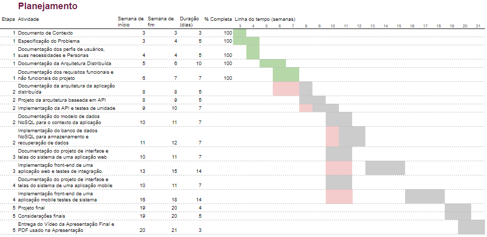

# Especificações do Projeto

Este projeto tem como intuito criar uma aplicação de mensagens distribuída que possa ser usada para comunicação em grupo. O sistema deve ser escalável e tolerante a falhas, permitindo que vários usuários possam se conectar ao mesmo tempo e enviar mensagens.

## Personas

A definição exata do problema e os pontos mais relevantes a serem tratados neste projeto foram consolidados com a participação dos usuários em um trabalho de imersão feito pelos membros da equipe a partir da observação dos usuários em seu local natural e por meio de entrevistas. Os detalhes levantados nesse processo foram consolidados na forma de personas e histórias de usuários.

Desta forma, constatou-se que o presente projeto possui 3 principais personas:

- **Jovens, universitários**: alunos de uma mesma sala de aula que buscam uma forma mais ágil para estudar em grupo e trocar informações, sem a distração das redes sociais. (na faixa de idade entre 18 e 39 anos).
- **Adultos:** pais e mães com filhos menores, preocupados com a segurança e privacidade de sua família. (na faixa de idade entre 40 e 59 anos ).
- **Idosos/aposentados:** pessoas que possuem dificuldades com as aplicações tradicionais de mensageria e buscam uma forma de comunicação à distância mais simples e segura. (faixa de idade acima de 60 anos de idade).

A seguir, passamos à análise detalhada das principais personas e suas respectivas histórias de usuários.

| Lana Del Rey                                                                                                           |                                                                                                                                                                                                                                              |                                                                                                                                           |
|------------------------------------------------------------------------------------------------------------------------|----------------------------------------------------------------------------------------------------------------------------------------------------------------------------------------------------------------------------------------------|-------------------------------------------------------------------------------------------------------------------------------------------|
|              | **Idade:** 22  anos - **Ocupação:** Estudante de Medicina.                                                                                                                                                                                   | Aplicativos: Instagram, Facebook, WhatsApp.                                                                                               |
| **Motivações:**  Lana gosta de trabalhar em grupo e está sempre em contato com os colegas da faculdade. Seu sonho é ser médica cardiologista. | **Frustrações:** Sempre que usa o WhatsApp ou Facebook, Lana acaba se distraindo com postagens e notícias banais. Ela e seus amigos buscam uma aplicação mais restrita para trocarem mensagens sobre os trabalhos e projetos da faculdade.   | **Hobbies, História:** Lana gosta de compor música e escrever poemas. As conversas com seus amigos são sua principal fonte de inspiração. | 

| Kênio e Kinca                                                                                                   |                                                                                                                                                                                                                                                                                                                         |                                                                                                                                                                                                                         |
|-----------------------------------------------------------------------------------------------------------------|-------------------------------------------------------------------------------------------------------------------------------------------------------------------------------------------------------------------------------------------------------------------------------------------------------------------------|-------------------------------------------------------------------------------------------------------------------------------------------------------------------------------------------------------------------------|
|  | **Idade:** 42 anos - **Ocupação:** Pais de 4 filhos.                                                                                                                                                                                                                                                                    | Aplicativos: Instagram, TikTok e WhatsApp.                                                                                                                                                                 |
| **Motivações:** Proporcionar aos filhos, segurança e proteção.                                                  | **Frustrações:** As crianças já estão inseridas no mundo das redes sociais e são curiosas. Os pais se preocupam em fornecer meios seguros para que os filhos possam utilizar a tecnologia de forma benéfica. Precisam de uma aplicação segura para manter conversas com os filhos quando estão na escola ou na natação. | **Hobbies, História:** Kênio e Kinca trabalham em casa e os filhos fazem muitas atividades externas, como cursos e esportes. Nas horas vagas, eles gostam de conversar com as crianças e postar fotos nas redes sociais. | 

| Tarcísio e Glória                                                                                                                                                                                                       |                                                                                                                                                                                                            |                                                                                                                                                  |
|-------------------------------------------------------------------------------------------------------------------------------------------------------------------------------------------------------------------------|------------------------------------------------------------------------------------------------------------------------------------------------------------------------------------------------------------|--------------------------------------------------------------------------------------------------------------------------------------------------|
|                                                                                                          | **Idade:** 69 anos - **Ocupação:** Aposentados, do lar.                                                                                                                                                    | Aplicativos: Facebook e Whatsapp.                                                                                                                |
| **Motivações:**  O casal de idosos moram juntos em uma bela casa no interior. Utilizam aplicativos de mensagens para manter seus familiares informados sobre como eles estão de saúde e para conversar sobre a família. | **Frustrações:** Por causa da idade avançada, o casal tem dificuldades para enchergar as mensagens no celular e dificuldades para enviar arquivos com segurança, como documentos e informações pessoais.   | **Hobbies, História:** Juntos, eles gostam de fotografar o jardim e as receitas que fazem juntos. Eles sempre enviam belas fotos para a família. | 

## Histórias de Usuários

Com base na análise das personas forma identificadas as seguintes histórias de usuários:

|EU COMO... `PERSONA`| QUERO/PRECISO ... `FUNCIONALIDADE`                                       | PARA ... `MOTIVO/VALOR`                                             |
|--------------------|--------------------------------------------------------------------------|---------------------------------------------------------------------|
|**Lana Del Rey** | *Uma aplicação que me mantenha longe de distrações e das redes sociais*. | Otimizar seu tempo e focar nas atividades escolares com seus colegas de classe. 
|**Kênio e Kinca** | *Manter conversas da família em segurança e preservar a privacidade*.    | Ter uma aplicação mais restrita ao grupo familiar, fortalecendo a proteção dos filhos. 
| **Tarcísio e Glória**  | *Aplicação mais simplista, dinâmica e minimalista.*                      | Manter comunicação com os filhos que moram na capital.              |

## Modelagem do Processo de Negócio 

### Análise da Situação Atual

Atualmente, há uma diversidade de aplicativos de mensageri.

### Descrição Geral da Proposta

Apresente aqui uma descrição da sua proposta abordando seus limites e suas ligações com as estratégias e objetivos do negócio. Apresente aqui as oportunidades de melhorias.

A proposta do Chatter é ser 

### Processo 1 – NOME DO PROCESSO

Apresente aqui o nome e as oportunidades de melhorias para o processo 1. Em seguida, apresente o modelo do processo 1, descrito no padrão BPMN. 

### Processo 2 – NOME DO PROCESSO

Apresente aqui o nome e as oportunidades de melhorias para o processo 2. Em seguida, apresente o modelo do processo 2, descrito no padrão BPMN.

## Indicadores de Desempenho

Apresente aqui os principais indicadores de desempenho e algumas metas para o processo. Atenção: as informações necessárias para gerar os indicadores devem estar contempladas no diagrama de classe. Colocar no mínimo 5 indicadores. 

Usar o seguinte modelo: 

Obs.: todas as informações para gerar os indicadores devem estar no diagrama de classe a ser apresentado a posteriori. 

## Requisitos

Sabendo que um requisito é a propriedade que um software exibe para solucionar problemas reais, sendo o nosso caso uma solução para um "problema" de comunicação, para a elaboração deste projeto, listamos os requisitos funcionais e não funcionais de acordo com o que analisamos ser necessário para execução do mesmo. A seleção desses requisitos foi baseada nos conceitos já estudado em períodos anteriores.

### Requisitos Funcionais

|ID    | Descrição do Requisito  | Prioridade |
|------|-----------------------------------------|----|
|RF-001| Registro de usuário: O aplicativo deve permitir que os usuários se registrem e criem uma conta para acessar seus recursos. | ALTA | 
|RF-002| Enviar mensagem: O aplicativo deve permitir que os usuários enviem mensagens de texto, imagens, áudio e vídeo para outros usuários.   | ALTA |
|RF-003| Receber mensagem: O aplicativo deve permitir que os usuários recebam mensagens enviadas por outros usuários.   | ALTA |
|RF-004| Compartilhamento de arquivos: O aplicativo deve permitir que os usuários compartilhem arquivos (como fotos e vídeos) com outros usuários.   | MÉDIA |
|RF-005| Histórico de mensagens: O aplicativo deve permitir que os usuários acessem seu histórico de mensagens e procurem por mensagens específicas.   | ALTA |
|RF-006| Personalização de perfil: O aplicativo deve permitir que os usuários personalizem seu perfil, incluindo imagem de perfil, status e outras informações pessoais.  | MÉDIA |
|RF-007| Suporte a múltiplas plataformas: O aplicativo deve estar disponível em dispositivos Android e Windows, para que os usuários possam acessá-lo em seus dispositivos preferidos.   | ALTA |
|RF-008| Excluir mensagens: O aplicativo deve permitir que os usuários excluam mensagens específicas ou toda uma conversa, sendo a mesma excluída de seu próprio dispositivo.   | MÉDIA |
|RF-009| Notificação de mensagens: O aplicativo deve notificar o usuário quando uma nova mensagem é recebida.     | ALTA |
|RF-010| Notificações push: O aplicativo deve ser capaz de enviar notificações push para alertar os usuários sobre novas mensagens recebidas.   | BAIXA |
|RF-011| Listas de contatos: Os usuários devem ser capazes de criar e gerenciar listas de contatos para que possam facilmente enviar mensagens a grupos específicos de pessoas.   | ALTA |
|RF-012| Verificação de status de entrega: Os usuários devem ser capazes de verificar se as mensagens que enviaram foram entregues com sucesso.   | MÉDIA |
|RF-013| Integração de emoji e GIFs: O aplicativo deve permitir que os usuários enviem e recebam emoji e GIFs em suas mensagens.   | BAIXA |
|RF-014| Sincronização entre dispositivos: permitir que os usuários acessem suas mensagens em vários dispositivos, como smartphones, tablets e computadores.   | ALTA |

### Requisitos não Funcionais

|ID     | Descrição do Requisito  |Prioridade |
|-------|-------------------------|----|
|RNF-001| Usabilidade: O aplicativo deve ser fácil de usar e entender, com uma interface intuitiva e recursos úteis para os usuários. Isso pode incluir requisitos de design, experiência do usuário e acessibilidade. | ALTA | 
|RNF-002| Confiabilidade: O aplicativo deve ser confiável, com mensagens entregues consistentemente e sem erros ou falhas. Isso pode incluir requisitos de redundância, backup de dados e testes de qualidade. |  ALTA | 
|RNF-003| Compatibilidade: O aplicativo deve ser compatível com sistemas operacionais Android e Windowns, e em dispositivos e versões de software diferentes, para que os usuários possam usá-lo em diferentes plataformas. |  ALTA |
|RNF-004| Manutenibilidade: O aplicativo deve ser fácil de manter e atualizar, com código limpo e bem documentado, além de possuir recursos que facilitem a resolução de problemas. |  MÉDIA |
|RNF-005| Desempenho: O aplicativo deve ser capaz de lidar com um grande número de mensagens simultaneas, sem atrasos ou falhas. |  BAIXA |
|RNF-006| Personalização: o aplicativo deve permitir que os usuários personalizem suas configurações e preferências de notificação. |  MÉDIA |
|RNF-007| Manutenção: o aplicativo deve ser fácil de atualizar e manter, sem causar interrupções para os usuários ou perder dados. |  ALTA |
|RNF-008| Desempenho: o aplicativo deve ser rápido e responsivo, sem atrasos significativos na entrega de mensagens ou na atualização da interface. |  ALTA |
|RNF-009| Customização: o aplicativo deve permitir que os usuários personalizem a aparência e o comportamento do aplicativo de acordo com suas preferências pessoais. |  BAIXA |

- [Requisitos Funcionais
 (RF)](https://pt.wikipedia.org/wiki/Requisito_funcional):
 correspondem a uma funcionalidade que deve estar presente na
  plataforma (ex: cadastro de usuário).
- [Requisitos Não Funcionais
  (RNF)](https://pt.wikipedia.org/wiki/Requisito_n%C3%A3o_funcional):
  correspondem a uma característica técnica, seja de usabilidade,
  desempenho, confiabilidade, segurança ou outro (ex: suporte a
  dispositivos iOS e Android).
Lembre-se que cada requisito deve corresponder à uma e somente uma
característica alvo da sua solução. Além disso, certifique-se de que
todos os aspectos capturados nas Histórias de Usuário foram cobertos.

## Restrições

O projeto está restrito pelos itens apresentados na tabela a seguir.

|ID| Restrição                                             |
|--|-------------------------------------------------------|
|01| O projeto deverá ser entregue até o final do semestre |
|02| Não pode ser desenvolvido um módulo de backend        |

Enumere as restrições à sua solução. Lembre-se de que as restrições geralmente limitam a solução candidata.

> **Links Úteis**:
> - [O que são Requisitos Funcionais e Requisitos Não Funcionais?](https://codificar.com.br/requisitos-funcionais-nao-funcionais/)
> - [O que são requisitos funcionais e requisitos não funcionais?](https://analisederequisitos.com.br/requisitos-funcionais-e-requisitos-nao-funcionais-o-que-sao/)

## Diagrama de Casos de Uso

O diagrama de casos de uso é o próximo passo após a elicitação de requisitos, que utiliza um modelo gráfico e uma tabela com as descrições sucintas dos casos de uso e dos atores. Ele contempla a fronteira do sistema e o detalhamento dos requisitos funcionais com a indicação dos atores, casos de uso e seus relacionamentos. 

As referências abaixo irão auxiliá-lo na geração do artefato “Diagrama de Casos de Uso”.

> **Links Úteis**:
> - [Criando Casos de Uso](https://www.ibm.com/docs/pt-br/elm/6.0?topic=requirements-creating-use-cases)
> - [Como Criar Diagrama de Caso de Uso: Tutorial Passo a Passo](https://gitmind.com/pt/fazer-diagrama-de-caso-uso.html/)
> - [Lucidchart](https://www.lucidchart.com/)
> - [Astah](https://astah.net/)
> - [Diagrams](https://app.diagrams.net/)

# Matriz de Rastreabilidade

| Requisito | Funcionalidade | Design | Desenvolvimento | Teste |
|-----------|----------------|---------|-----------------------|-------|
| Interface simples e minimalista |  |  X | X | X |
| Atraente para todos os usuários |  | X | X | X |
| Comunicação entre diferentes plataformas | X | X | X | X |
| Recursos intuitivos e de fácil acesso | X | X | X | X |
| Melhorar a comunicação para empresas e equipes | X | X | X | X |
| Acessibilidade para usuários mais velhos |  | X | X | X |
| Solução para comunicação entre diferentes dispositivos e sistemas | X | X | X | X |

# Gerenciamento de Projeto

De acordo com o PMBoK v6, as dez áreas que constituem os pilares para gerenciar projetos, e que caracterizam a multidisciplinaridade envolvida, são: Integração, Escopo, Cronograma (Tempo), Custos, Qualidade, Recursos, Comunicações, Riscos, Aquisições, Partes Interessadas. Devido a sua interconexão, é essencial detalhar esses aspectos do projeto.

## Gerenciamento de Tempo

O gráfico de Gantt ou diagrama de Gantt também é uma ferramenta visual utilizada para controlar e gerenciar o cronograma de atividades de um projeto. Com ele, é possível listar tudo que precisa ser feito para colocar o projeto em prática, dividir em atividades e estimar o tempo necessário para executá-las.

No momento, o diagrama mostra o planejamento mais geral das entregas de cada etapa, sendo que as tarefas específicas e seus responsáveis são definidos a cada sprint e gerenciados no [Microsoft Planner](https://tasks.office.com/sgapucminasbr.onmicrosoft.com/pt-BR/Home/Planner/#/plantaskboard?groupId=b2f50c33-795c-4898-b98d-8e101e9a50dc&planId=_aRpoM24dk6R1JSYpdDmnWQACBdM). O Microsoft Planner é um aplicativo de planejamento disponível na plataforma Microsoft 365, orientado ao trabalho em equipe. De acordo com o planejamento mais generalizado feito com antecedência, o grupo planejará, a cada sprint, a divisão de tarefas, bem como a estimativa de tempo necessário para completá-las. Por meio do Planner, também será feita a visualização geral das atividades, bem como o acompanhamento da evolução dos requisitos.

## Gerenciamento de Equipe

O gerenciamento adequado de tarefas contribuirá para que o projeto alcance altos níveis de produtividade. Por isso, é fundamental que ocorra a gestão de tarefas e de pessoas, de modo que os times envolvidos no projeto possam ser facilmente gerenciados. 

Conforme mencionado no item anterior, o [Microsoft Planner](https://tasks.office.com/sgapucminasbr.onmicrosoft.com/pt-BR/Home/Planner/#/plantaskboard?groupId=b2f50c33-795c-4898-b98d-8e101e9a50dc&planId=_aRpoM24dk6R1JSYpdDmnWQACBdM) apresenta o detalhamento de cada sprint:

No Microsoft Planner, as tarefas podem também ser rastreadas por status, bucket, prioridade e responsável, bem como seu estado de execução:

Além disso, o quadro Kanban no Planner é atualizado após a realização de commits associados a tarefas nas sprints, demonstrado na imagem:

## Gestão de Orçamento

O processo de determinar o orçamento do projeto é uma tarefa que depende, além dos produtos (saídas) dos processos anteriores do gerenciamento de custos, também de produtos oferecidos por outros processos de gerenciamento, como o escopo e o tempo. Foram feitos cálculos considerando custos relativos a pessoal para um total de 6 pessoas.

| Item de orçamento	|	Custo estimado (em reais) |
| -------- | ------------- |
| Hardware	| R$80.000	|
| Desenvolvedores	| R$60.000/mês |
| Gerente de Projeto	| R$15.000/mês |
| Investimento em Pessoal | R$30.000 |
| Registro de domínio e Certificado SSL	|	R$3.000 |
| Publicidade e marketing	|	R$10.000 |
| Contingência	|	R$30.000 |
| Total | R$512.000 |

