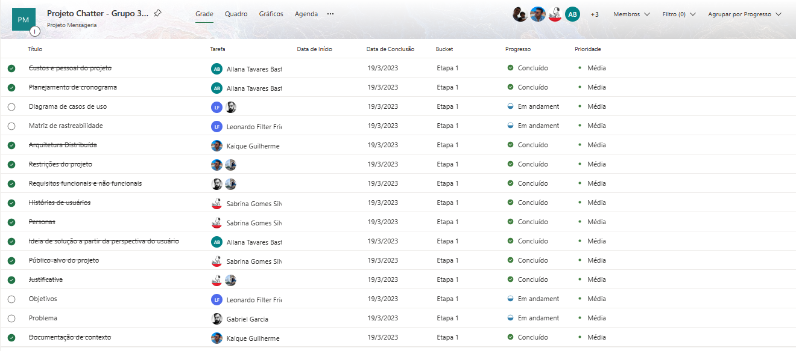
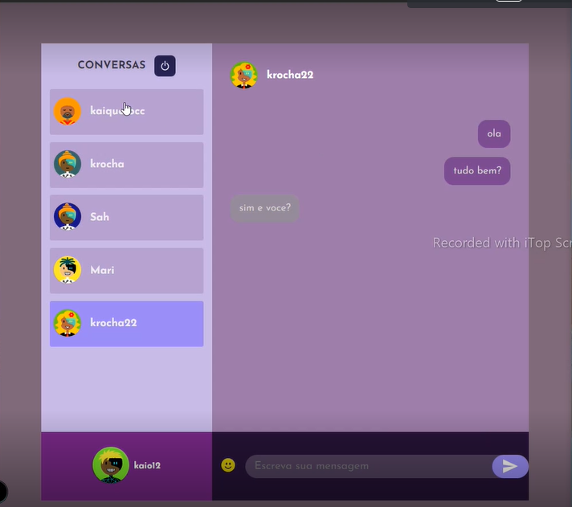

# Especificações do Projeto

Este projeto tem como intuito criar uma aplicação de mensagens distribuída que possa ser usada para comunicação em grupo. O sistema deve ser escalável e tolerante a falhas, permitindo que vários usuários possam se conectar ao mesmo tempo e enviar mensagens.

## Personas

A definição exata do problema e os pontos mais relevantes a serem tratados neste projeto foram consolidados com a participação dos usuários em um trabalho de imersão feito pelos membros da equipe a partir da observação dos usuários em seu local natural e por meio de entrevistas. Os detalhes levantados nesse processo foram consolidados na forma de personas e histórias de usuários.

Desta forma, constatou-se que o presente projeto possui 3 principais personas:

- **Jovens, universitários**: alunos de uma mesma sala de aula que buscam uma forma mais ágil para estudar em grupo e trocar informações, sem a distração das redes sociais. (na faixa de idade entre 18 e 39 anos).
- **Adultos:** pais e mães com filhos menores, preocupados com a segurança e privacidade de sua família. (na faixa de idade entre 40 e 59 anos ).
- **Idosos/aposentados:** pessoas que possuem dificuldades com as aplicações tradicionais de mensageria e buscam uma forma de comunicação à distância mais simples e segura. (faixa de idade acima de 60 anos de idade).

A seguir, passamos à análise detalhada das principais personas e suas respectivas histórias de usuários.

| Lana Del Rey                                                                                                           |                                                                                                                                                                                                                                              |                                                                                                                                           |
|------------------------------------------------------------------------------------------------------------------------|----------------------------------------------------------------------------------------------------------------------------------------------------------------------------------------------------------------------------------------------|-------------------------------------------------------------------------------------------------------------------------------------------|
|              | **Idade:** 22  anos - **Ocupação:** Estudante de Medicina.                                                                                                                                                                                   | Aplicativos: Instagram, Facebook, WhatsApp.                                                                                               |
| **Motivações:**  Lana gosta de trabalhar em grupo e está sempre em contato com os colegas da faculdade. Seu sonho é ser médica cardiologista. | **Frustrações:** Sempre que usa o WhatsApp ou Facebook, Lana acaba se distraindo com postagens e notícias banais. Ela e seus amigos buscam uma aplicação mais restrita para trocarem mensagens sobre os trabalhos e projetos da faculdade.   | **Hobbies, História:** Lana gosta de compor música e escrever poemas. As conversas com seus amigos são sua principal fonte de inspiração. | 

| Kênio e Kinca                                                                                                   |                                                                                                                                                                                                                                                                                                                         |                                                                                                                                                                                                                         |
|-----------------------------------------------------------------------------------------------------------------|-------------------------------------------------------------------------------------------------------------------------------------------------------------------------------------------------------------------------------------------------------------------------------------------------------------------------|-------------------------------------------------------------------------------------------------------------------------------------------------------------------------------------------------------------------------|
|  | **Idade:** 42 anos - **Ocupação:** Pais de 4 filhos.                                                                                                                                                                                                                                                                    | Aplicativos: Instagram, TikTok e WhatsApp.                                                                                                                                                                 |
| **Motivações:** Proporcionar aos filhos, segurança e proteção.                                                  | **Frustrações:** As crianças já estão inseridas no mundo das redes sociais e são curiosas. Os pais se preocupam em fornecer meios seguros para que os filhos possam utilizar a tecnologia de forma benéfica. Precisam de uma aplicação segura para manter conversas com os filhos quando estão na escola ou na natação. | **Hobbies, História:** Kênio e Kinca trabalham em casa e os filhos fazem muitas atividades externas, como cursos e esportes. Nas horas vagas, eles gostam de conversar com as crianças e postar fotos nas redes sociais. | 

| Tarcísio e Glória                                                                                                                                                                                                       |                                                                                                                                                                                                            |                                                                                                                                                  |
|-------------------------------------------------------------------------------------------------------------------------------------------------------------------------------------------------------------------------|------------------------------------------------------------------------------------------------------------------------------------------------------------------------------------------------------------|--------------------------------------------------------------------------------------------------------------------------------------------------|
|                                                                                                          | **Idade:** 69 anos - **Ocupação:** Aposentados, do lar.                                                                                                                                                    | Aplicativos: Facebook e Whatsapp.                                                                                                                |
| **Motivações:**  O casal de idosos moram juntos em uma bela casa no interior. Utilizam aplicativos de mensagens para manter seus familiares informados sobre como eles estão de saúde e para conversar sobre a família. | **Frustrações:** Por causa da idade avançada, o casal tem dificuldades para enchergar as mensagens no celular e dificuldades para enviar arquivos com segurança, como documentos e informações pessoais.   | **Hobbies, História:** Juntos, eles gostam de fotografar o jardim e as receitas que fazem juntos. Eles sempre enviam belas fotos para a família. | 

### Persona em Destaque:

As três personas apresentadas foram identificadas como possíveis usuários de nossa aplicação, e conhecer suas respectivas histórias é importante para que o grupo possa identificar as principais metas a traçar, estabelecendo as funcionalidades e requisitos mais importantes. Contudo, conforme aprendemos nas aulas de "Microfundamento: Projeto de Software" (Projeto de UX, tema 1, Unidade 1): "as interfaces devem promover a interação utilizável, acessível e prazerosa por parte das personas de usuário identificadas. Além de resolver um problema do usuário, o software deve oferecer uma experiência positiva durante o seu uso."

Assim, ressaltamos que a persona "Universitário" será nosso foco a princípio, considerando que as demais personas irão requerer o desenvolvimento de soluções mais específicas, pois tratam-se de crianças e idosos. Dessa forma, os elementos estéticos, como a combinação de cores, tipografias, tamanhos e estilos de textos, deverão atender às suas características e necessidades especiais.

## Histórias de Usuários

Com base na análise das personas forma identificadas as seguintes histórias de usuários:

|EU COMO... `PERSONA`| QUERO/PRECISO ... `FUNCIONALIDADE`                                       | PARA ... `MOTIVO/VALOR`                                             |
|--------------------|--------------------------------------------------------------------------|---------------------------------------------------------------------|
|**Lana Del Rey** | *Uma aplicação que me mantenha longe de distrações e das redes sociais*. | Otimizar seu tempo e focar nas atividades escolares com seus colegas de classe. 
|**Kênio e Kinca** | *Manter conversas da família em segurança e preservar a privacidade*.    | Ter uma aplicação mais restrita ao grupo familiar, fortalecendo a proteção dos filhos. 
| **Tarcísio e Glória**  | *Aplicação mais simplista, dinâmica e minimalista.*                      | Manter comunicação com os filhos que moram na capital.              |

## Modelagem do Processo de Negócio 

### Análise da Situação Atual

Atualmente, há uma diversidade de aplicativos de mensageria, como WhatsApp, Telegram, Signal, RabbitMQ, XMPP e MQTT. Cada um desses aplicativos oferece recursos diferentes para os usuários, como a capacidade de enviar mensagens de texto, fotos e vídeos, fazer chamadas de voz e vídeo, criar grupos e compartilhar arquivos. Alguns aplicativos também têm recursos de segurança avançados, como criptografia de ponta a ponta, opções de bloqueio e verificação em duas etapas.

No entanto, cada aplicativo tem suas limitações. Alguns podem ser difíceis de usar para usuários mais velhos ou com deficiências, enquanto outros podem não ter recursos avançados de segurança. Além disso, alguns aplicativos podem não estar disponíveis em todos os países ou podem ter restrições de uso. Por isso, os usuários podem precisar usar vários aplicativos diferentes para atender às suas necessidades de mensageria, o que pode ser confuso e inconveniente.

Com a crescente demanda por soluções de mensageria distribuída, espera-se que surjam novos aplicativos e recursos no futuro para atender às necessidades dos usuários. Um exemplo disso é a inclusão de pessoas mais idosas, visto que populações mundiais tem envelhecido. Porém, como o grupo de introdução de trends são jovens, esse precisa ser o público-alvo para a garantia da ampla adoção do aplicativo.

### Descrição Geral da Proposta

A proposta do Chatter é ser um aplicativo puramente de mensageria que tenha os recursos necessários a um público-alvo jovem, mas também com recursos de inclusividade. Para atender às necessidades de idosos, o aplicativo deve ser fácil de usar e ter uma interface intuitiva. Isso inclui opções de botões maiores, fontes claras e opções de acessibilidade para usuários com deficiências visuais ou auditivas - alterações essas que devem ser intuitivas para configuração no primeiro uso do aplicativo. O aplicativo também deve incluir recursos para ajudar os idosos a se conectarem com seus amigos e familiares, como um diretório de contatos e uma lista de favoritos.

Além de limitações de volume da aplicação desenvolvida, recursos de segurança não serão tão avançados quanto outras soluções no mercado. Além disso, não serão incluídos recursos de stories, que fogem ao escopo do projeto apesar de presentes em alguns aplicativos de mensageria.

Em resumo, a solução ideal seria um aplicativo de mensageria distribuído que combina recursos modernos e divertidos com uma interface fácil de usar para atender às necessidades de jovens e idosos. 

### Envio de mensagens atualmente

A grande quantidade de aplicativos de mensageria sobrecarrega a memória dos celulares de jovens e pode confundir os mais idosos.

### Envio de mensagens com o Chatter

Unificando o envio de mensagens em uma solução intuitiva e acessível, o processo é bem simplificado para quaisquer usuários.

## Indicadores de Desempenho

Apresente aqui os principais indicadores de desempenho e algumas metas para o processo. Atenção: as informações necessárias para gerar os indicadores devem estar contempladas no diagrama de classe. Colocar no mínimo 5 indicadores. 

Usar o seguinte modelo: 

Obs.: todas as informações para gerar os indicadores devem estar no diagrama de classe a ser apresentado a posteriori. 

## Requisitos

Sabendo que um requisito é a propriedade que um software exibe para solucionar problemas reais, sendo o nosso caso uma solução para um "problema" de comunicação, para a elaboração deste projeto, listamos os requisitos funcionais e não funcionais de acordo com o que analisamos ser necessário para execução do mesmo. A seleção desses requisitos foi baseada nos conceitos já estudado em períodos anteriores.

### Requisitos Funcionais

|ID    | Descrição do Requisito  | Prioridade |
|------|-----------------------------------------|----|
|RF-001| Registro de usuário: O aplicativo deve permitir que os usuários se registrem e criem uma conta para acessar seus recursos, sendo eles as mensagens e as funcionalidades da aplicação. | ALTA | 
|RF-002| Enviar mensagem: O aplicativo deve permitir que os usuários enviem mensagens de texto, imagens, áudio e vídeo para outros usuários.   | ALTA |
|RF-003| Receber mensagem: O aplicativo deve permitir que os usuários recebam mensagens enviadas por outros usuários.   | ALTA |
|RF-004| Compartilhamento de arquivos: O aplicativo deve permitir que os usuários compartilhem arquivos (como fotos e vídeos) com outros usuários.   | MÉDIA |
|RF-005| Histórico de mensagens: O aplicativo deve permitir que os usuários acessem seu histórico de mensagens e possam procurar por mensagens específicas.   | BAIXA |
|RF-006| Personalização de perfil: O aplicativo deve permitir que os usuários personalizem seu perfil, incluindo imagem de perfil, status e outras informações pessoais.  | MÉDIA |
|RF-007| Excluir mensagens: O aplicativo deve permitir que os usuários excluam mensagens específicas ou toda uma conversa, sendo a mesma excluída de seu próprio dispositivo.   | MÉDIA |
|RF-008| Notificação de mensagens: O aplicativo deve notificar o usuário quando uma nova mensagem é recebida, através de um alerta sonoro.     | ALTA |
|RF-009| Notificações push: O aplicativo deve ser capaz de enviar notificações push para alertar os usuários sobre novas mensagens recebidas.   | ALTA |
|RF-010| Listas de contatos: Os usuários devem ser capazes de criar e gerenciar listas de contatos, para que possam facilmente enviar mensagens a grupos específicos de pessoas.   | MÉDIA |
|RF-011| Verificação de status de entrega: Os usuários devem ser capazes de verificar se as mensagens que enviaram foram entregues com sucesso.   | MÉDIA |
|RF-012| Integração de emoji e GIFs: O aplicativo deve permitir que os usuários enviem e recebam emoji e GIFs em suas mensagens.   | BAIXA |
|RF-013| Sincronização entre dispositivos: permitir que os usuários acessem suas mensagens em vários dispositivos, como smartphones, tablets e computadores.   | ALTA |
|RF-014| Busca de mensagens: A aplicação deve permitir que os usuários pesquisem suas mensagens antigas.   | ALTA |

### Requisitos não Funcionais

|ID     | Descrição do Requisito  |Prioridade |
|-------|-------------------------|----|
|RNF-001| Usabilidade: O aplicativo deve focar nos conceitos de usabilidade, dando ênfase a critérios dentro de design e acessibilidade. | ALTA | 
|RNF-002| Confiabilidade: O aplicativo deve ser confiável, com mensagens entregues consistentemente e sem erros ou falhas. |  ALTA | 
|RNF-003| Compatibilidade: O aplicativo deve ser compatível com sistemas operacionais Android e Windowns, para que os usuários possam usá-lo em diferentes plataformas. |  MÉDIA |
|RNF-004| Manutenibilidade: O aplicativo deve ser fácil de manter e atualizar, com código limpo e bem documentado, além de possuir recursos que facilitem a resolução de problemas. |  MÉDIA |
|RNF-005| Desempenho: O aplicativo deve ser capaz de lidar com um grande número de mensagens simultaneas, sem atrasos ou falhas. |  MÉDIA |
|RNF-006| Personalização: o aplicativo deve permitir que os usuários personalizem suas configurações e preferências de notificação. |  BAIXA |
|RNF-007| Desempenho: O aplicativo deve ser rápido e responsivo, sem atrasos significativos na entrega de mensagens ou na atualização da interface. |  ALTA |
|RNF-008| Regulamentação: O aplicativo deve estar em conformidade com as regulamentações de privacidade e segurança de dados. |  ALTA |

## Restrições

O projeto está restrito pelos itens apresentados na tabela a seguir.

|ID| Restrição                                             |
|--|-------------------------------------------------------|
|01| O projeto deve ser implementado com uso de tecnologias front end, back end e mobile, podendo fazer uso de bibliotecas que influenciem positivamente na qualidade do software. |
|02| O projeto deverá ter seu código versionado utilizando Git.       |
|03| O projeto completo, com suas respectivas funcionalidades, necessita ser entregue até o dia 25/06/2023, respeitando o prazo estipulado.        |
|04| Restrições de idade: a aplicação deverá exigir que os usuários tenham no mínimo 13 anos para usar o serviço, para que sejam cumpridas as leis de privacidade de dados.        |
|05| Restrições de contato: a aplicaçaõ deverá permitir que os usuários restrinjam quem pode entrar em contato com eles, por meio de bloqueios.         |
|06| Opções de privacidade de perfil: A aplicação deverá conter opções para limitar quem pode ver o perfil do usuário ou suas informações de contato.       |

## Diagrama de Casos de Uso

O diagrama de caso de uso foi essencial para o processo de desenvolvimento de software. Ele representa graficamente os principais requisitos funcionais do sistema, identificando as principais interações entre os usuários e a plataforma. Abaixo segue como o diagrama de caso de uso foi elaborado a partir dos requisitos funcionais da plataforma Chatter.

Esses requisitos incluem a criação de grupos, o compartilhamento de arquivos, a troca de mensagens privadas entre usuários e a publicação de atualizações de status. A partir desses requisitos, é possível identificar os principais atores do sistema, que são os usuários um e dois.

Com base nos requisitos e nos atores identificados, foi possível elaborar o diagrama de caso de uso da plataforma Chatter. Esse diagrama representa de forma clara e concisa os principais casos de uso do sistema, incluindo as principais funcionalidades que cada ator pode utilizar.

Cada caso de uso foi descrito, incluindo informações como os pré-requisitos para a execução de cada caso, as principais etapas do processo e as saídas esperadas.

Ao finalizar o diagrama de caso de uso da plataforma Chatter, foi possível visualizar de forma clara e organizada as principais funcionalidades do sistema e as principais interações entre os usuários e a plataforma. Isso permitirá que os desenvolvedores tenham uma visão clara dos principais requisitos do sistema e possam desenvolver o software de forma mais eficiente e eficaz.

Segue o link do caso de uso da plataforma Chatter criado no Lucid Chart:

https://lucid.app/lucidchart/4272b0b8-c43d-499d-ab3d-67cc1e0e873d/edit?viewport_loc=-1117%2C98%2C3139%2C1367%2C0_0&invitationId=inv_74b46407-e9b4-43f5-b57d-15a242d2e6a1

# Matriz de Rastreabilidade

| Requisito | Funcionalidade | Design | Desenvolvimento | Teste |
|-----------|----------------|---------|-----------------------|-------|
| Interface simples e minimalista |  |  X | X | X |
| Atraente para todos os usuários |  | X | X | X |
| Comunicação entre diferentes plataformas | X | X | X | X |
| Recursos intuitivos e de fácil acesso | X | X | X | X |
| Melhorar a comunicação para empresas e equipes | X | X | X | X |
| Acessibilidade para usuários mais velhos |  | X | X | X |
| Solução para comunicação entre diferentes dispositivos e sistemas | X | X | X | X |

# Gerenciamento de Projeto

De acordo com o PMBoK v6, as dez áreas que constituem os pilares para gerenciar projetos, e que caracterizam a multidisciplinaridade envolvida, são: Integração, Escopo, Cronograma (Tempo), Custos, Qualidade, Recursos, Comunicações, Riscos, Aquisições, Partes Interessadas. Devido a sua interconexão, é essencial detalhar esses aspectos do projeto.

## Gerenciamento de Tempo

O gráfico de Gantt ou diagrama de Gantt também é uma ferramenta visual utilizada para controlar e gerenciar o cronograma de atividades de um projeto. Com ele, é possível listar tudo que precisa ser feito para colocar o projeto em prática, dividir em atividades e estimar o tempo necessário para executá-las.

No momento, o diagrama mostra o planejamento mais geral das entregas de cada etapa, sendo que as tarefas específicas e seus responsáveis são definidos a cada sprint e gerenciados no [Microsoft Planner](https://tasks.office.com/sgapucminasbr.onmicrosoft.com/pt-BR/Home/Planner/#/plantaskboard?groupId=b2f50c33-795c-4898-b98d-8e101e9a50dc&planId=_aRpoM24dk6R1JSYpdDmnWQACBdM). O Microsoft Planner é um aplicativo de planejamento disponível na plataforma Microsoft 365, orientado ao trabalho em equipe. De acordo com o planejamento mais generalizado feito com antecedência, o grupo planejará, a cada sprint, a divisão de tarefas, bem como a estimativa de tempo necessário para completá-las. Por meio do Planner, também será feita a visualização geral das atividades, bem como o acompanhamento da evolução dos requisitos.

## Gerenciamento de Equipe

O gerenciamento adequado de tarefas contribuirá para que o projeto alcance altos níveis de produtividade. Por isso, é fundamental que ocorra a gestão de tarefas e de pessoas, de modo que os times envolvidos no projeto possam ser facilmente gerenciados. 

Conforme mencionado no item anterior, o [Microsoft Planner](https://tasks.office.com/sgapucminasbr.onmicrosoft.com/pt-BR/Home/Planner/#/plantaskboard?groupId=b2f50c33-795c-4898-b98d-8e101e9a50dc&planId=_aRpoM24dk6R1JSYpdDmnWQACBdM) apresenta o detalhamento de cada sprint:

No Microsoft Planner, as tarefas podem também ser rastreadas em um quadro Kanban por status, bucket, prioridade e responsável, bem como seu estado de execução:

Além disso, o Planner permite acompanhar a produtividade dos membros, demonstrado na imagem:

## Gestão de Orçamento

O processo de determinar o orçamento do projeto é uma tarefa que depende, além dos produtos (saídas) dos processos anteriores do gerenciamento de custos, também de produtos oferecidos por outros processos de gerenciamento, como o escopo e o tempo. Foram feitos cálculos considerando custos relativos a pessoal para um total de 6 pessoas.

| Item de orçamento	|	Custo estimado (em reais) |
| -------- | ------------- |
| Hardware	| R$80.000	|
| Desenvolvedores	| R$60.000/mês |
| Gerente de Projeto	| R$15.000/mês |
| Investimento em Pessoal | R$30.000 |
| Registro de domínio e Certificado SSL	|	R$3.000 |
| Publicidade e marketing	|	R$10.000 |
| Contingência	|	R$30.000 |
| Total | R$512.000 |

