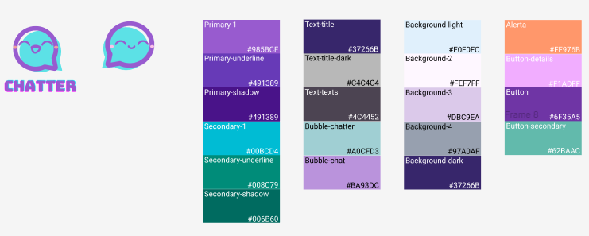

# Projeto de Interface

Pré-requisitos: <a href="2-Especificação do Projeto.md"> Documentação de Especificação</a>

Visão geral da interação do usuário pelas telas do sistema e protótipo interativo das telas com as funcionalidades que fazem parte do sistema (wireframes).

### Componentes

Desenvolvemos a logo do aplicativo pensando em cores que transmitam respeito e confiança, por isso a escolha de um roxo como cor principal e de um azul como cor secundária. A paleta de cores foi escolhida a partir do roxo principal, de modo a ter um resultado harmônico e coerente. Para conferir a acessibilidade dessa paleta, foi utilizada a ferramenta de [conferência de contraste](https://color.adobe.com/create/color-contrast-analyzer) Adobe, bem como para [acessibilidade para daltônicos](https://color.adobe.com/create/color-accessibility). Desse modo, garante-se a inclusão e uma boa experiência para qualquer usuário.

### Wireframes

Para os diagramas de fluxo, foram desenvolvidos wireframes, conforme pode ser conferido na próxima seção. Também foram desenhados mock-ups no Figma. É possível conferir no Figma:
- [Componentes e wireframes](https://www.figma.com/file/X9SSvru1fxiSpt4fG94GpG/Chatter?type=design&node-id=101-1520)
- [Mock-up Web](https://www.figma.com/file/X9SSvru1fxiSpt4fG94GpG/Chatter?type=design&node-id=0-1)
- [Mock-up App](https://www.figma.com/file/X9SSvru1fxiSpt4fG94GpG/Chatter?type=design&node-id=3-4)
- [Protótipo interativo Web](https://www.figma.com/proto/X9SSvru1fxiSpt4fG94GpG/Chatter?type=design&node-id=3-4&scaling=scale-down&page-id=3%3A4&starting-point-node-id=3%3A5)
- [Protótipo interativo App](https://www.figma.com/proto/X9SSvru1fxiSpt4fG94GpG/Chatter?type=design&node-id=26-223&scaling=contain&page-id=0%3A1&starting-point-node-id=26%3A223)

Para registro dos mock-ups, temos:

## Diagrama de Fluxo

O diagrama apresenta o estudo do fluxo de interação do usuário com o sistema interativo, permitindo que o design das interações seja bem planejado e gere impacto na qualidade no design do wireframe interativo que será desenvolvido logo em seguida.

### No wireframe web

O fluxo web foi pensado para ser o mais intuitivo possível para pessoas que já utilizam ou não a plataforma.

### No wireframe app

O fluxo do aplicativo igualmente foi desenhado para ser intuitivo. Assim, atende-se aos requisitos não só do público-alvo, mas também de outros possíveis públicos, como idosos.

