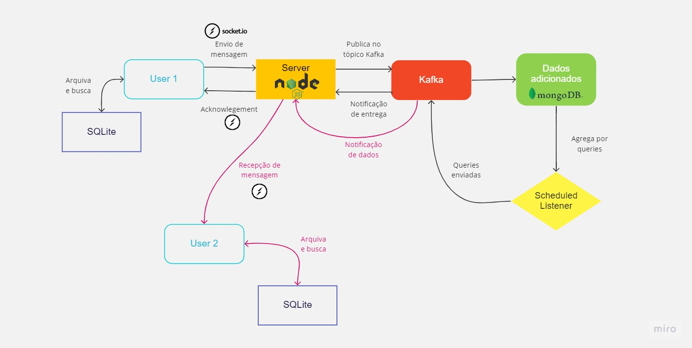
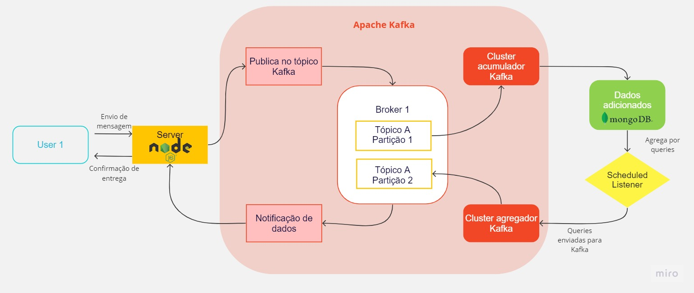

# Arquitetura da Solução

Iremos utilizar o Kafka Apache para enviar e receber mensagens de texto (SMS). A comunicação com o cliente será feita por node.js. No entanto, para uma comunicação em tempo real entre o cliente e o servidor, como um chat em tempo real, é necessário utilizar sockets. Nesse caso, a socket.io se comunica com o servidor node.js. Para integração dessa API, iremos utilizar React JS e para armazenamento dos dados persistentes será usado o MongoDB.

## Diagrama de Classes

O diagrama de classes ilustra graficamente como será a estrutura do software, e como cada uma das classes da sua estrutura estarão interligadas. Essas classes servem de modelo para materializar os objetos que executarão na memória.

As referências abaixo irão auxiliá-lo na geração do artefato “Diagrama de Classes”.

> - [Diagramas de Classes - Documentação da IBM](https://www.ibm.com/docs/pt-br/rational-soft-arch/9.6.1?topic=diagrams-class)
> - [O que é um diagrama de classe UML? | Lucidchart](https://www.lucidchart.com/pages/pt/o-que-e-diagrama-de-classe-uml)

## Processos e suas Respectivas Atividades

Nesta sessão, apresentaremos os modelos de gestão do projeto: BPMN, Tabelas, Gráficos ou Dashboards com no mínimo 5 indicadores de desempenho e metas para o processo de negócio e para o processo de desenvolvimento.

Com auxílio das aulas de Modelagem e Gestão de Processos e Negócios, o grupo determinou como método de gestão de processos, o modelo “**Ciclo BPM**”.

É importante destacar a abordagem de que processo é um trabalho ponta a ponta que atravessa a empresa de maneira transversal ou horizontal para criar valor para o cliente. Para Silva (2017, p. 49): “*Processos ponta a ponta são processos que nascem da necessidade do cliente, passam por várias áreas e departamentos, e terminam na entrega do produto ou serviço para o cliente*”.

Assim, o grupo pretende diminuir a complexidade, fazer o projeto de forma mais ágil e com menos recursos.

Para reforçar o comprometimento com o gerenciamento dos processos, iremos realizar um ciclo contínuo, incluindo as seguintes atividades:

1. **Planejamento** = Início do ciclo; orientação estratégica da organização. Quais serão os processos que atenderão esses preceitos da estratégia: detalhamento.
2. **Análise** = compreender as atividades do processos e os resultados que serão entregues. A organização tem condições de realizar? Quais as dificuldades? A análise é realizada por meio de algumas técnicas, com modelagens, entrevistas com as pessoas envolvidas, simulações, etc. Aqui, ainda não se objetiva encontrar soluções, mas apenas analisar eventuais problemas que possam ocorrer. O processo como ele é.
3. **Desenho** = preocupar com as mudanças necessárias do processo que impactarão o alcance das metas e das organizações, visando a satisfação do cliente. Valor do produto que será entregue. O design (desenho) indica algo futuro. Que deverá ser executado. Como o processo será, já incorporadas as melhores detectadas na fase de Análise (To-be)? Em que momento serão implementados os recursos de tecnologias e os responsáveis do processos. Metas e indicadores e como serão suas implementações, como serão executados.
4. **Implementação** = novo as-is. Nessa fase, modelagem, automação, rp, rm, a implementação irá envolver a programação dessas ferramentas. Preparação das bases de dados, etc. Ao seu final, espera-se o processo em execução (automatizado ou manual, ou híbridos)
5. **Monitoriamento e Controle** = a execução do processo será acompanhada. Não só observar, mas é necessário também agir no sentido de controlar as interferências: medições, comparações, indicadores, *Dashboards*, mapas, cartões, etc. Tudo isso para garantir o alinhamento com as estratégias estabelecidas pelo grupo.
6. **Refinamento** = Os ajustes, aperfeiçoar a implementação. Por mais que seja bem planejado, o processo muitas vezes necessita de refinamentos. O refinamento fecha o ciclo BPM de gerenciamento de processos de negócios.

A imagem abaixo demonstra o monitoramento e controle dos 6 elementos, gerados através de dados no Planner, registrados pelos membros, de suas respectivas atividades:

### Modelo e Notação de Processos de Negócio
O modelo *Business Process Model and Notation* (BPMN ou em português Modelo e Notação de Processos de Negócio), foi utilizado para descrever o processo de metodologia adotado para o processo de desenvolvimento e para o processo de negócios. Por ser padronizada, a notação BPMN facilitará o entendimento das pessoas envolvidas no projeto.
Neste sentido, com o modelo BPMN, utilizaremos o seu conjunto de elementos gráficos para representar aquelas atividades de trabalho, agrupadas em processos, para indicar como eles serão executados.

Abaixo está o modelo do fluxo de mensagens entre os usuarios A e B e suas determinadas interações com a Aplicação durante uma conversa: 

## Modelo Físico

Segue abaixo o modelo físico contendo os scripts de criação da tabela "usuário" do banco de dados. Este modelo inclui a definição dos campos que farão parte da tabela, bem como as restrições de integridade necessárias.

Segue abaixo o modelo físico contendo os scripts de criação da tabela "mensagem" do banco de dados. Este modelo inclui a definição dos campos que farão parte da tabela, bem como as restrições de integridade necessárias.

Segue abaixo o modelo físico contendo os scripts de criação da tabela "conversa" do banco de dados. Este modelo inclui a definição dos campos que farão parte da tabela, bem como as restrições de integridade necessárias.

## Tecnologias Utilizadas

As linguagens de programação Javascript, React Native e Node.js foram escolhidas para a aplicação por dois motivos. Primeiro, essas tecnologias são altamente escaláveis e permitem que a aplicação suporte muitos usuários simultâneos.
Outro motivo para a escolha dessas linguagens de programação foi a experiência do grupo de desenvolvimento com elas. Como os desenvolvedores já possuíam habilidades prévias com Javascript, React Native e Node.js, foi mais eficiente para eles implementar essas tecnologias no app "chatter"

| Linguagem         | Aplicação       |
|------------------|-----------------|
| Node.js          | BackEnd         |
| Node.js          | WebAPI Rest     |
| Javascript       | FrontEnd WEB    |
| React Native     | FrontEnd Mobile |
| VSCode           | Software de Código |
| Mongo DB        | Banco de Dados |
| Postman         | Teste de API    |

## Documentação da Implementação da WEB API Rest:

| Operação | Chamada HTTP |
|----------|--------------|
| Read     | GET          |
| Create   | POST         |
| Create   | POST         |
| Create   | POST         |

## Hospedagem

Explique como a hospedagem e o lançamento da plataforma foi feita.

> **Links Úteis**:
>
> - [Website com GitHub Pages](https://pages.github.com/)
> - [Programação colaborativa com Repl.it](https://repl.it/)
> - [Getting Started with Heroku](https://devcenter.heroku.com/start)
> - [Publicando Seu Site No Heroku](http://pythonclub.com.br/publicando-seu-hello-world-no-heroku.html)

## Qualidade de Software

Conceituar qualidade de fato é uma tarefa complexa, mas ela pode ser vista como um método gerencial que através de procedimentos disseminados por toda a organização, busca garantir um produto final que satisfaça às expectativas dos stakeholders.

No contexto de desenvolvimento de software, qualidade pode ser entendida como um conjunto de características a serem satisfeitas, de modo que o produto de software atenda às necessidades de seus usuários. Entretanto, tal nível de satisfação nem sempre é alcançado de forma espontânea, devendo ser continuamente construído. Assim, a qualidade do produto depende fortemente do seu respectivo processo de desenvolvimento.

A norma internacional ISO/IEC 25010, que é uma atualização da ISO/IEC 9126, define oito características e 30 subcaracterísticas de qualidade para produtos de software.
Com base nessas características e nas respectivas sub-características, identifique as sub-características que sua equipe utilizará como base para nortear o desenvolvimento do projeto de software considerando-se alguns aspectos simples de qualidade. Justifique as subcaracterísticas escolhidas pelo time e elenque as métricas que permitirão a equipe avaliar os objetos de interesse.

> **Links Úteis**:
>
> - [ISO/IEC 25010:2011 - Systems and software engineering — Systems and software Quality Requirements and Evaluation (SQuaRE) — System and software quality models](https://www.iso.org/standard/35733.html/)
> - [Análise sobre a ISO 9126 – NBR 13596](https://www.tiespecialistas.com.br/analise-sobre-iso-9126-nbr-13596/)
> - [Qualidade de Software - Engenharia de Software 29](https://www.devmedia.com.br/qualidade-de-software-engenharia-de-software-29/18209/)
