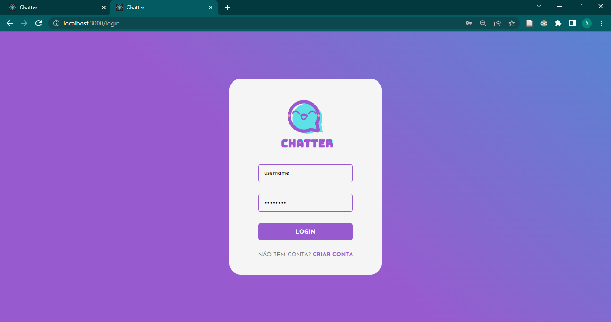

# Template Padrão da Aplicação

Pré-requisitos: <a href="2-Especificação do Projeto.md"> Especificação do Projeto</a>, <a href="3-Projeto de Interface.md"> Projeto de Interface</a>, <a href="4-Metodologia.md"> Metodologia</a>

Layout padrão da aplicação que será utilizado em todas as páginas com a definição de identidade visual, aspectos de responsividade e iconografia. Para maiores detalhes da iconografia e demais elementos visuais, conferir <a href="03-Projeto de Interface.md"> Projeto de Interface</a>.

### Web

É possível conferir as telas desenvolvidas, bem como um vídeo que mostram-nas em ação: [vídeo]( https://sgapucminasbr.sharepoint.com/sites/team_sga_865_2023_1_5964102-Grupo3/_layouts/15/stream.aspx?id=%2Fsites%2Fteam%5Fsga%5F865%5F2023%5F1%5F5964102%2DGrupo3%2FDocumentos%20Compartilhados%2FGrupo%203%2F20230422%5F231335%2Emp4&referrer=Teams%2ETEAMS%2DWEB&referrerScenario=teams%2Dchiclet )

### App

Em desenvolvimento
